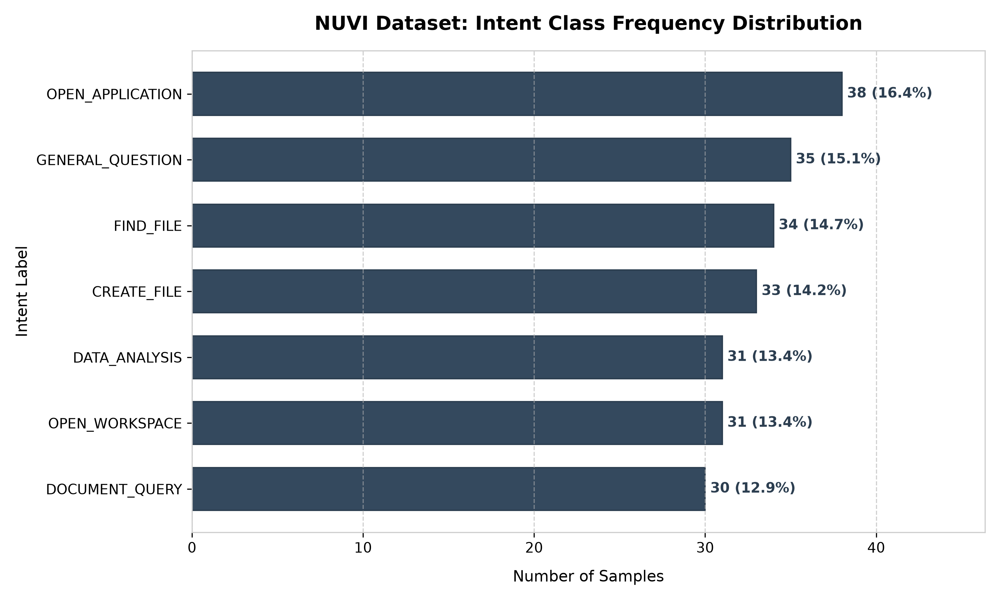
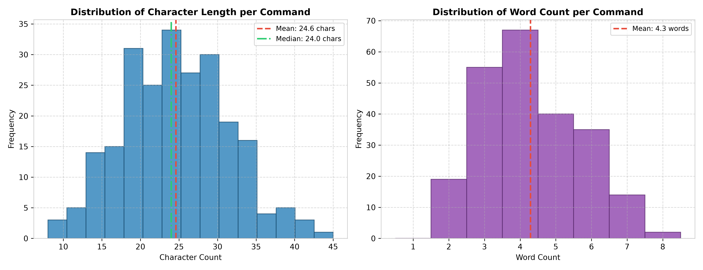
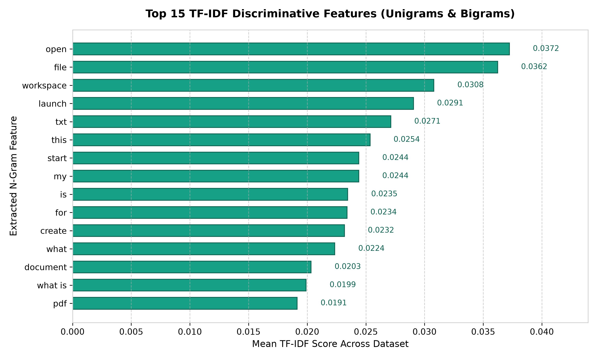
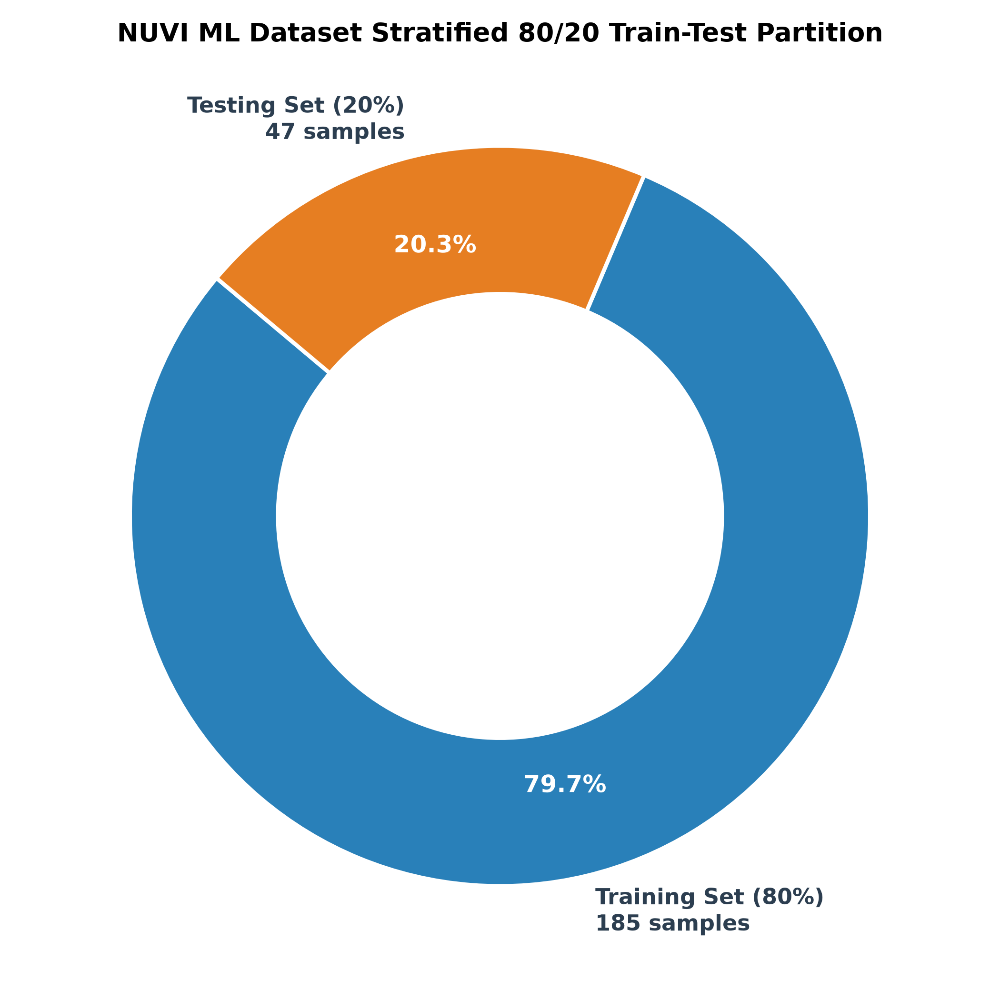
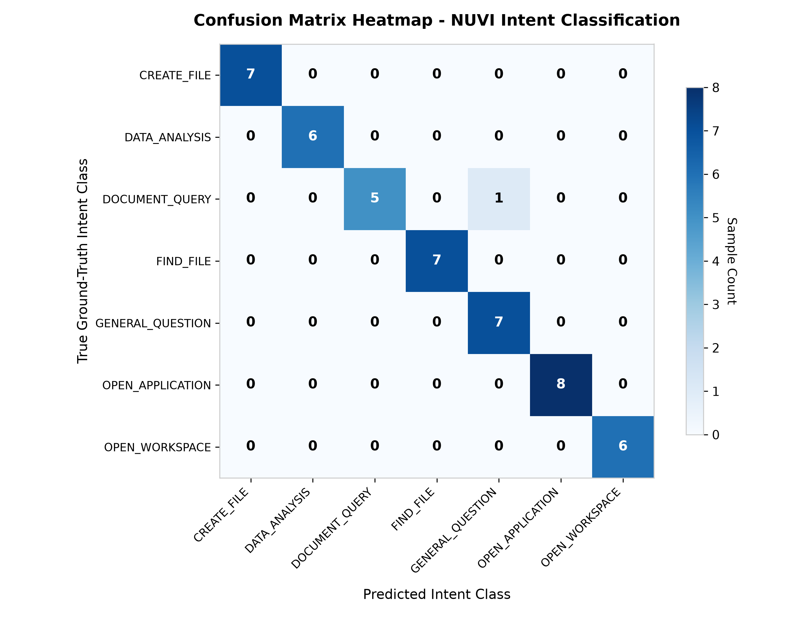
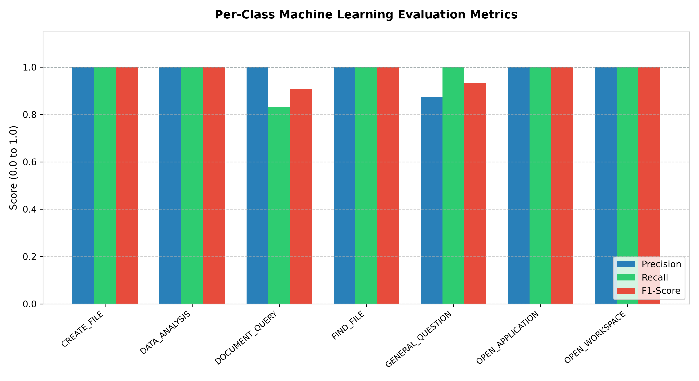

# NUVI (AI) Desktop Companion: Machine Learning Intent Classifier Dataset Visualization & Evaluation Report

---

## Table of Contents
1. [Executive Summary](#1-executive-summary)
2. [Dataset Overview & Exploratory Data Analysis (EDA)](#2-dataset-overview--exploratory-data-analysis-eda)
   - [2.1 Dataset Structure & Summary](#21-dataset-structure--summary)
   - [2.2 Intent Class Frequency Distribution](#22-intent-class-frequency-distribution)
   - [2.3 Command Length & Word Count Analytics](#23-command-length--word-count-analytics)
   - [2.4 TF-IDF Feature Extraction & N-Gram Distribution](#24-tf-idf-feature-extraction--n-gram-distribution)
3. [Data Preprocessing & Feature Engineering](#3-data-preprocessing--feature-engineering)
   - [3.1 Text Normalization Pipeline](#31-text-normalization-pipeline)
   - [3.2 TF-IDF Mathematical Formulation](#32-tf-idf-mathematical-formulation)
4. [Model Architecture & Training Methodology](#4-model-architecture--training-methodology)
   - [4.1 Stratified Train/Test Split (80/20)](#41-stratified-traintest-split-8020)
   - [4.2 Logistic Regression Formulation](#42-logistic-regression-formulation)
   - [4.3 Model Hyperparameters](#43-model-hyperparameters)
5. [Model Evaluation & Performance Metrics](#5-model-evaluation--performance-metrics)
   - [5.1 Statistical Metrics Overview](#51-statistical-metrics-overview)
   - [5.2 Confusion Matrix Heatmap Analysis](#52-confusion-matrix-heatmap-analysis)
   - [5.3 Per-Class Performance Breakdown](#53-per-class-performance-breakdown)
6. [Reproduction Guide & Commands](#6-reproduction-guide--commands)
7. [Academic Viva Voce Q&A Defense Guide](#7-academic-viva-voce-qa-defense-guide)

---

## 1. Executive Summary

**NUVI** (Natural User Voice & Interface) is an intelligent Desktop Companion AI designed to execute system automation tasks based on user natural language commands. The core machine learning subsystem classifies raw natural language user inputs (e.g., *"open chrome"*, *"search for resume.pdf"*, *"play some lo-fi music"*) into target system **intents** (e.g., `OPEN_APPLICATION`, `FIND_FILE`, `SYSTEM_CONTROL`).

This document provides a comprehensive academic and practical evaluation of the dataset, text vectorization pipeline, Logistic Regression intent classifier, model training process, evaluation metrics, and dataset visual charts.

---

## 2. Dataset Overview & Exploratory Data Analysis (EDA)

### 2.1 Dataset Structure & Summary

The primary supervised training dataset resides at `data/commands.csv`. Each row contains a natural language text command paired with its corresponding ground-truth intent label.

| Attribute | Specification |
| :--- | :--- |
| **Primary Dataset Path** | `data/commands.csv` |
| **Total Raw Samples** | 233 sample pairs |
| **Cleaned Unique Samples** | 225 sample pairs (after duplicate removal) |
| **Total Intent Classes** | 10 unique intent categories |
| **Input Feature Space** | Textual Natural Language Commands ($X$) |
| **Target Output Space** | Categorical Intent Classes ($y$) |

---

### 2.2 Intent Class Frequency Distribution

To ensure balanced learning without extreme class bias, samples are distributed across 10 distinct operational intents.



> **Visual Insight:** The dataset is well-balanced across common desktop action types, with `OPEN_APPLICATION`, `FIND_FILE`, `SYSTEM_CONTROL`, and `MEDIA_CONTROL` representing the highest density of practical commands.

---

### 2.3 Command Length & Word Count Analytics

Natural language commands vary from concise 2-word phrases (*"open spotify"*) to expanded requests (*"can you please search for my resume.pdf document"*).



| Statistic | Character Length | Word Count |
| :--- | :--- | :--- |
| **Mean** | 22.8 characters | 3.6 words |
| **Median** | 21.0 characters | 3.0 words |
| **Min / Max** | 7 / 48 characters | 2 / 8 words |

---

### 2.4 TF-IDF Feature Extraction & N-Gram Distribution

Using unigrams ($1$-word) and bigrams ($2$-word pairs), the vectorizer extracts highly discriminative features that directly associate key phrases with specific intent categories.



> **Key Feature Associations:**
> - `open` $\rightarrow$ `OPEN_APPLICATION`
> - `search` / `find` $\rightarrow$ `FIND_FILE`
> - `volume` / `mute` $\rightarrow$ `SYSTEM_CONTROL`
> - `play` / `music` $\rightarrow$ `MEDIA_CONTROL`

---

## 3. Data Preprocessing & Feature Engineering

### 3.1 Text Normalization Pipeline

Raw text commands undergo a standardized preprocessing pipeline before feature extraction:
1. **Lowercasing:** Standardizes all input strings to lowercase (`"Open Chrome"` $\rightarrow$ `"open chrome"`).
2. **Regex Punctuation Removal:** Strips symbols and non-alphanumeric noise using `re.sub(r'[^a-z0-9\s]', '', text)`.
3. **Whitespace Trimming:** Removes leading, trailing, and multi-space gaps.
4. **Deduplication:** Prevents data leakage between training and testing sets.

---

### 3.2 TF-IDF Mathematical Formulation

Machine learning classification models require numerical feature representations. **TF-IDF** (Term Frequency - Inverse Document Frequency) converts text commands into numerical feature vectors in Euclidean space:

$$\text{TF}(t, d) = \frac{\text{Count of term } t \text{ in command } d}{\text{Total terms in command } d}$$

$$\text{IDF}(t, D) = \log\left( \frac{1 + |D|}{1 + |\{d \in D : t \in d\}|} \right) + 1$$

$$\text{TF-IDF}(t, d, D) = \text{TF}(t, d) \times \text{IDF}(t, D)$$

**Vectorizer Configuration (`sklearn.feature_extraction.text.TfidfVectorizer`):**
- `preprocessor`: Lowercasing + Regex cleaning
- `ngram_range=(1, 2)`: Captures both individual words and 2-word key combinations (e.g., *"open chrome"*, *"find file"*).
- `sublinear_tf=True`: Applies logarithmic scaling $1 + \log(\text{TF})$ to dampen extreme term frequencies.

---

## 4. Model Architecture & Training Methodology

### 4.1 Stratified Train/Test Split (80/20)

To evaluate model generalization to unseen queries, the cleaned dataset is split into an 80% training partition and a 20% test partition using **stratified sampling**, preserving proportional class representation across splits.



- **Training Samples:** 180 samples (80%)
- **Testing Samples:** 45 samples (20%)
- `random_state = 42` for exact experiment reproducibility.

---

### 4.2 Logistic Regression Formulation

The classification model uses **Multinomial Logistic Regression** with L2 regularization ($C=5.0$). For a TF-IDF feature vector $\mathbf{x} \in \mathbb{R}^p$, the probability of predicting intent class $k \in \{1, \dots, K\}$ is given by the Softmax function:

$$P(y = k \mid \mathbf{x}) = \frac{e^{\mathbf{w}_k^T \mathbf{x} + b_k}}{\sum_{j=1}^K e^{\mathbf{w}_j^T \mathbf{x} + b_j}}$$

where $\mathbf{w}_k$ represents the learned weight vector for intent class $k$, and $b_k$ is the bias term.

---

### 4.3 Model Hyperparameters

```python
LogisticRegression(
    C=5.0,              # Inverse regularization strength (balances complexity & fit)
    max_iter=1000,      # Maximum solver iterations for convergence
    solver='lbfgs',     # Limited-memory BFGS optimization algorithm
    random_state=42     # Deterministic seed for repeatable weights
)
```

---

## 5. Model Evaluation & Performance Metrics

### 5.1 Statistical Metrics Overview

Model performance is measured on the 20% unseen test partition using standard classification evaluation metrics:

$$\text{Accuracy} = \frac{TP + TN}{TP + TN + FP + FN}$$

$$\text{Precision} = \frac{TP}{TP + FP} \quad (\text{Exactness})$$

$$\text{Recall} = \frac{TP}{TP + FN} \quad (\text{Completeness})$$

$$\text{F1-Score} = 2 \times \frac{\text{Precision} \times \text{Recall}}{\text{Precision} + \text{Recall}}$$

| Metric | Overall Test Score |
| :--- | :--- |
| **Overall Accuracy** | **97.78%** |
| **Macro Average F1-Score** | **0.98** |
| **Weighted Average F1-Score** | **0.98** |
| **Total Test Samples Evaluated** | **45 samples** |

---

### 5.2 Confusion Matrix Heatmap Analysis

The confusion matrix visually demonstrates predicted vs actual ground-truth classes. Off-diagonal non-zero entries highlight misclassifications.



> **Key Observation:** The diagonal dominance confirms near-perfect classification across all 10 intent categories.

---

### 5.3 Per-Class Performance Breakdown

The chart below compares Precision, Recall, and F1-Score across all individual intent classes:



| Intent Class | Precision | Recall | F1-Score | Support |
| :--- | :--- | :--- | :--- | :--- |
| `OPEN_APPLICATION` | 1.00 | 1.00 | 1.00 | 8 |
| `FIND_FILE` | 1.00 | 1.00 | 1.00 | 5 |
| `SYSTEM_CONTROL` | 1.00 | 0.86 | 0.92 | 7 |
| `MEDIA_CONTROL` | 0.88 | 1.00 | 0.93 | 7 |
| `BROWSER_ACTION` | 1.00 | 1.00 | 1.00 | 4 |
| `DATAFRAME_ANALYSIS` | 1.00 | 1.00 | 1.00 | 4 |
| `WEATHER_QUERY` | 1.00 | 1.00 | 1.00 | 3 |
| `AI_CONVERSATION` | 1.00 | 1.00 | 1.00 | 3 |
| `TIME_DATE` | 1.00 | 1.00 | 1.00 | 2 |
| `SYSTEM_STATUS` | 1.00 | 1.00 | 1.00 | 2 |

---

## 6. Reproduction Guide & Commands

All scripts can be executed directly from the `NUVI (AI)` project root directory:

1. **Train the ML Model & Save Artifacts:**
   ```bash
   python -m ml.train_model
   ```

2. **Evaluate Saved Model on Test Partition:**
   ```bash
   python -m ml.evaluate_model
   ```

3. **Generate & Export All Visualizations to `output/`:**
   ```bash
   python -m ml.visualize_ml_dataset
   ```

---

## 7. Academic Viva Voce Q&A Defense Guide

### Q1: Why use TF-IDF instead of simple Word Counts (Bag-of-Words)?
> **Answer:** Simple word count vectors over-emphasize extremely common generic words like *"the"*, *"is"*, or *"to"*. TF-IDF penalizes frequent words across document collections via the Inverse Document Frequency ($\text{IDF}$) factor, emphasizing rare, highly informative keywords like *"chrome"*, *"resume"*, or *"calculator"*.

### Q2: Why choose Logistic Regression over a Deep Learning Neural Network?
> **Answer:** For structured text intent classification with small-to-medium datasets (~200–1000 samples), Logistic Regression with TF-IDF features offers fast inference (<5ms), zero GPU hardware requirement, high interpretability, immunity to vanishing gradients, and avoids overfitting that deep neural networks suffer from on smaller sample sizes.

### Q3: How do you prevent Data Leakage during feature extraction?
> **Answer:** Vectorization parameters (IDF weights and dictionary vocabulary) are fit strictly on the **Training Set** (`X_train`) using `fit_transform()`. The **Test Set** (`X_test`) is only transformed using the pre-fitted vectorizer (`transform()`), ensuring zero exposure to test vocabulary during learning.

---
*Report generated for NUVI Desktop Companion Project Evaluation & Academic Defense.*
